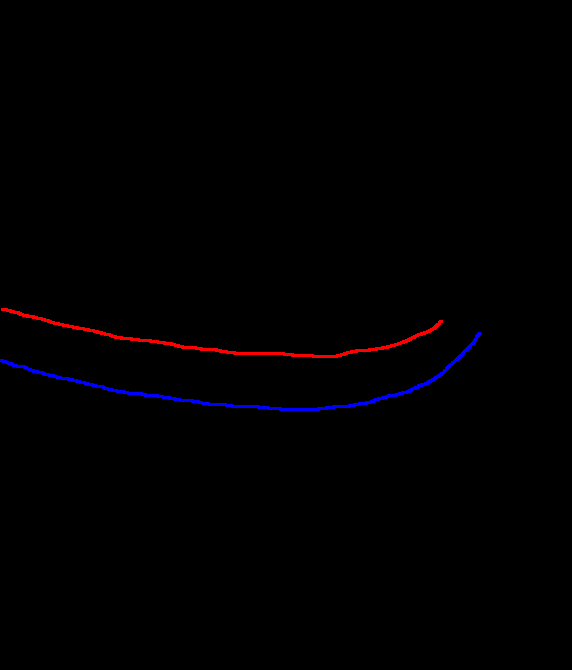
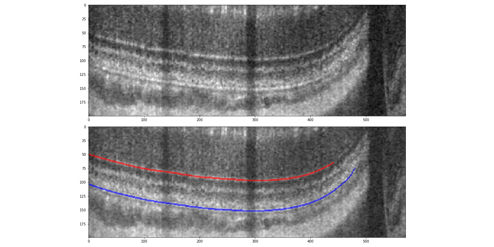

# Monte Carlo Double-line

Semi-automatic horizontal line segmentation for OCT scans based on double line 

### Usage

1. Read first slice and save the file
2. Prepeare first mask based on saved files(colors denotes different lines to be tracked)
3. Run correction algorithm for every other bscans

### Example of initial mask and result

### Limitation

Works only for almost horizontal lines (contact me if you want to work with arbitrary lines)
